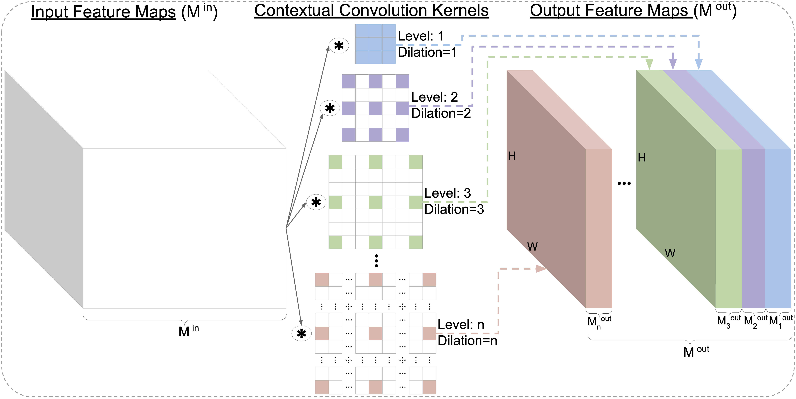

## Contextual Convolutional Neural Networks

This is a PyTorch implementation of ["Contextual Convolutional Neural Networks"](https://arxiv.org/pdf/2108.07387.pdf).



The models trained on ImageNet can be found [here](https://drive.google.com/drive/folders/1DZZd51is2beeGjScHwBMmrNNXVe57yfU?usp=sharing).


Contextual Convolution (CoConv) is able to provide improved recognition capabilities over the baseline
(see [the paper](https://arxiv.org/pdf/2108.07387.pdf) for details).

The accuracy on ImageNet (using the default training settings):


| Network | 50-layers |101-layers |152-layers |
| :----- | :-----: | :-----: |:-----: |
| ResNet  | 76.12% ([model](https://drive.google.com/uc?export=download&id=176TS0b6O0NALBbfzpz4mM1b47s4dwSVH)) | 78.00% ([model](https://drive.google.com/uc?export=download&id=1bermctRPLs5DIsHB0c4iDIGHvjfERPLG)) | 78.45% ([model](https://drive.google.com/uc?export=download&id=1FAggTH4m7Kec8MyRe8dx-ugI_yh-nLzL))|
| CoResNet  | **77.27**% ([model](https://drive.google.com/uc?export=download&id=1fnANwWhU6SjRpPLSHIji-nLNhdVdtBSs))| **78.71**% ([model](https://drive.google.com/uc?export=download&id=10-oJYZtPrlnM4H9aKxvI-Osjhjm5B1WL))| **79.03**% ([model](https://drive.google.com/uc?export=download&id=1dzo1gd7l6_T57wWcfyxSddGlec1foClD))|


### Requirements

Install PyTorch and ImageNet dataset following the [official PyTorch ImageNet training code](https://github.com/pytorch/examples/tree/master/imagenet).

A fast alternative (without the need to install PyTorch and other deep learning libraries) is to use [NVIDIA-Docker](https://docs.nvidia.com/deeplearning/frameworks/pytorch-release-notes/pullcontainer.html#pullcontainer), 
we used [this container image](https://docs.nvidia.com/deeplearning/frameworks/pytorch-release-notes/rel_19-05.html#rel_19-05).


### Training
To train a model (for instance, CoResNet with 50 layers) using DataParallel run `main.py`; 
you need also to provide `result_path` (the directory path where to save the results
 and logs) and the `--data` (the path to the ImageNet dataset): 
```bash
result_path=/your/path/to/save/results/and/logs/
mkdir -p ${result_path}
python main.py \
--data /your/path/to/ImageNet/dataset/ \
--result_path ${result_path} \
--arch coresnet \
--model_depth 50
```
To train using Multi-processing Distributed Data Parallel Training follow the instructions in the 
[official PyTorch ImageNet training code](https://github.com/pytorch/examples/tree/master/imagenet).

### Citation
If you find our work useful, please consider citing:
```
@article{duta2021contextual,
  author  = {Ionut Cosmin Duta and Mariana Iuliana Georgescu and Radu Tudor Ionescu},
  title   = {Contextual Convolutional Neural Networks},
  journal = {arXiv preprint arXiv:2108.07387},
  year    = {2021},
}
```

